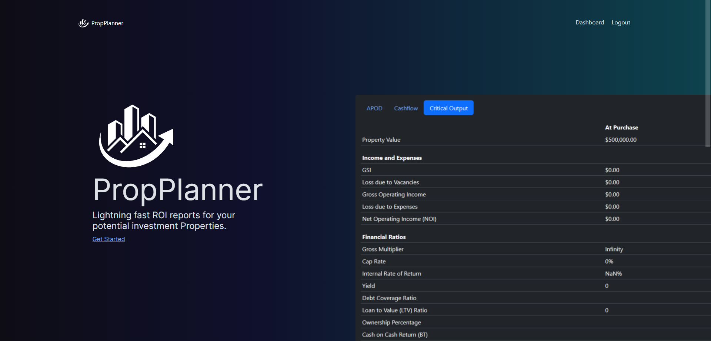
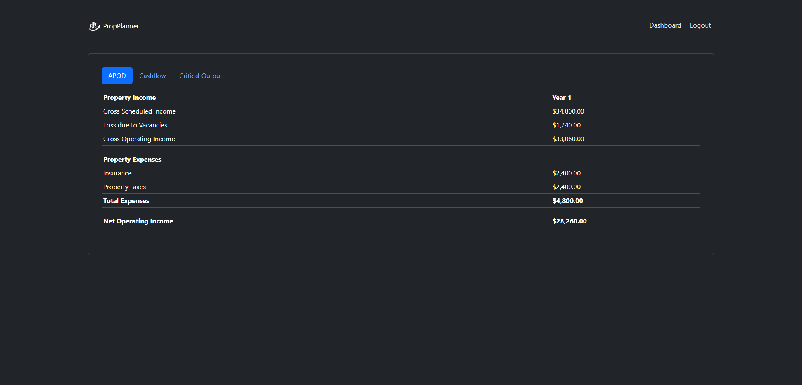

​
# PropPlanner Description

PropPlanner is an API focused on observing recorded real estate data and comparing it with trending data for the purpose of better investment strategy. 
Using MLS data, public records data, and other trending data making a real-time comparison score. This is to help the investor have relevant data to help them decide whether or not investing in a property is a sound financial strategy. 

## Usage
​
Navigate to the following [URL](https://propplanner-production.up.railway.app/) to access the application. You can see a quick preview of it's features in the screenshots section [below](#screenshots).
​
Once you are on the landing page, click the sign-up button. Fill in the form, type in a username, an email address, and select a password. After logging in, you will go to the dashboard. Near the top heading, you'll see a small dark icon of a house with a "+" in it. Click the icon to begin a file on a new property. 

Filling out the information fully will take you to the next set of inputs that will help you determine the total amount of income, and the various expenses to help you narrow down your reports. The more information you input, the more refined your reports will be. 

After filling in all of your inputs, click the reports button either in the property file, or on the dash next to the property file. 

​These reports generated are designed to give you a real impression for your decision making process.

## Core Contributors
- [Nate Tanner](https://github.com/tannernd)
- [Jared Boehm](https://github.com/JaredBoehm)
- [Nick](https://github.com/NikWhit)
- [Eden Lewis](https://github.com/edenlewis)
- [Olivia Perkins](https://github.com/oSweets13)
​
## User Story - Elevator Pitch

As a real estate investor, I want a useful, online tool with up-to-date information from knowledgeable sources that will help me determine whether or not an investment has an adequate ROI. 
PropPlanner is robust and granular enough to plan the investment all the way through a 5 year window, calculating income and expenses to organize a very real expectation of your investment. 
While the primary purpose of PropPlanner is a real estate investment calculator, it is much more than an amortization or financial calculator because it follows through with touch-points that a property owner should expect, but also includes some of the things that tenants expect that may not be considered by the property owner. 
PropPlanner is a resource for accurate information, and acts as a central location for the information regarding your investment property, including visual graphs to help you visualize comparisons between your investment and your return. 
​
​
## Screenshots
​

​
